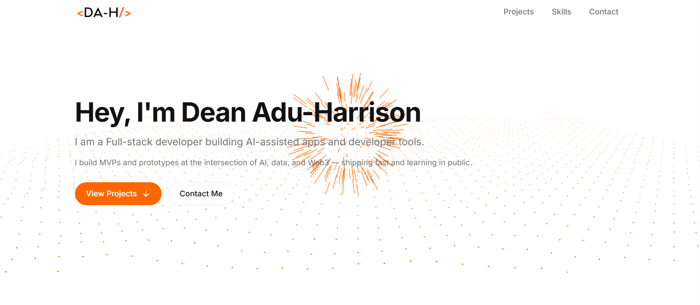

<!--x axis divider-->

  

 

<!--x axis divider-->

<h1 align="center">Hi 👋, I'm Dean Adu-Harrison</h1>
<h3 align="center">A Full-stack and AI-assisted developer building experimental web apps and developer tools.</h3>

<h3 align="center">✨My Portfolio Website✨</h3>

<!--x axis divider-->

  
<h3 align="left">👋About👋</h3>

 I love exploring and building AI-driven apps, data visualization and developer productivity tools. I continue to learn and grow every day.

- 👨‍💻 All of my projects are available at [My Github Profile](https://github.com/DeanMojo?tab=repositories)

- 👨‍💻 You can check out my personal projects here  [My Portfolio](https://dean-harrison.lovable.app)

- 📫 How to reach me **deanadu23@gmail.com**

  

<!-- Connect with me -->
<h3 align="center">🤝Connect with Me🤝</h3>

  <ul align="center">
    
<h3 style="display: inline-block">🧑‍💻Frequently Used Tech🧑‍💻</h3>

  </ul>

<!-- use https://skillicons-picker.derikn.com -->

<!--x axis divider-->

  

